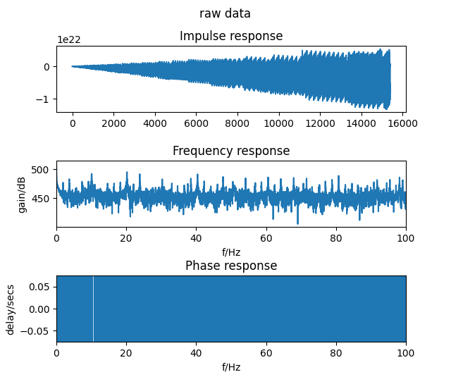
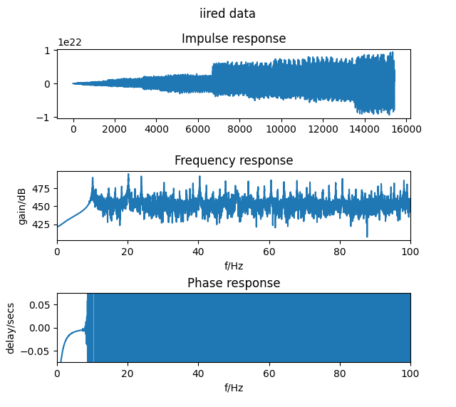

## Realtime plotting and sending (UDP) of filtered/PTS EMG signals :chart_with_upwards_trend:

The first image displays the raw data, while the second shows the high-pass filtered and power-time-smoothed EMG data (Fc = 10Hz; smoothed over 5 samples) to be sent via UDP.

---



---



---

## Pre-requisites 

Before running the code, an IIR filter library from Dr Bernd Porr must be installed in advance. For the library and how to install, see [here](https://github.com/berndporr/iir1).

Adapt the path of iir1 lib in the .pro file to the iir1 path on your computer.

---

## Action :movie_camera:


```
    git clone https://github.com/TheUltraSoundGuys/RTEP.git
    cd RTEP/Rpi_end/'unit tests in RPI end'/'Data filter+udp sending unit'
    qmake
    make
```

To run (assuming you are logged into the RPi over ssh and no X-server is running):

```
    ./QwtExample
```

